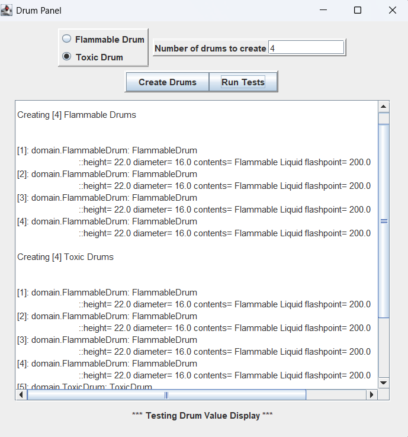

# 🥁 Drum Container Management System


A Java Swing application for managing hazardous material drums with complete OOP implementation and GUI interface.

<p align="center">
  
</p>
<p align="center">Output</p>

## Key OOP Concepts
1. Abstract classes/methods
2. Inheritance (FlammableDrum/ToxicDrum)
3. Encapsulation
4. Polymorphism

## 🔥 Features
- **Drum Type Management**
  - Flammable Drums (with flashpoint tracking)
  - Toxic Drums (with toxicity classification)
- **Precision Calculations**
  - Different capacity formulas for each drum type
  - 3/4 capacity rule for toxic drums
- **Modern GUI**
  - Interactive Swing interface
  - Batch creation of drums
  - Detailed reporting

## 🚀 How to Run
1. Ensure Java 21+ is installed
2. Clone repository:
```bash
git clone https://github.com/yourusername/repo-name.git
```
3. Compile and run:
```bash
javac test/Drum_Test.java
java test/Drum_Test
```

## 🧪 Example Output
```java
ToxicDrum: ToxicDrum
 ::height: 36.0 diameter: 24.0 contents: Radioactive Isotopes capacity= 339.292 toxicity: CLASS_IA
```
